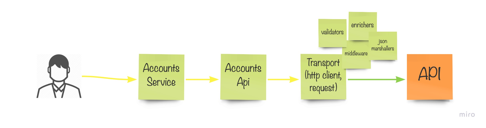

# Form3 Take Home Exercise

- [Form3 Take Home Exercise](#form3-take-home-exercise)
  * [Instructions](#instructions)
  * [Project Structure](#project-structure)
  * [How To Run](#how-to-run)
  * [Awailable Commands](#awailable-commands)
- [Technical decisions](#technical-decisions)
- [TODO](#todo)
    + [Should](#should)
      - [Docker-compose](#docker-compose)
    + [Please don't](#please-don-t)
  * [How to submit your exercise](#how-to-submit-your-exercise)
  * [License](#license)

<small><i><a href='http://ecotrust-canada.github.io/markdown-toc/'>Table of contents generated with markdown-toc</a></i></small>

## Instructions
This exercise has been designed to be completed in 4-8 hours. The goal of this exercise is to write a client library
in Go to access our fake [account API](http://api-docs.form3.tech/api.html#organisation-accounts) service.

## Project Structure

```
    .
    ├── LICENSE
    ├── Makefile
    ├── README.md
    ├── cmd
    │   ├── services
    │   │   └── accounts          # accounts services
    │   │   └── health            # api health services
    │   └── transport             # data transport layer
    ├── docker-compose.yml
    ├── go.mod
    ├── go.sum
    ├── integration                 # integration tests
    ├── pkg
    │   └── version.go
    └── scripts
```

## How To Run

```
    $ make lint
    $ make docker-build
    $ make services-up
    $ make unit-tests
    $ make e2e-tests
    $ make services-down
```

Integrate with `docker-compose`

```
TODO
```

## Awailable Commands

<!-- START makefile-doc -->
```
$ make help 
services-up                    Run services
services-down                  Run services
e2e-tests                      Integration tests
unit-tests                     Run tests
lint                           Run linters
validate                       Validate files with pre-commit hooks
docker-build                   Build docker container
docker-run                     Run commands in docker container e.g. make docker-run COMMAND='make go-tidy' 
```
<!-- END makefile-doc -->

# Technical decisions

- Started with Health service, to:
    - Build up a project skeleton
    - Create a transport intefrace, without diving deep into functional implementation
- Investigate API over Postmat,Curl and Swagger
    - Minimum requirements for `Create`, `Fetch` and `Delete`
    - Get the understanding on Pagination flow
- Client library has 3
- Currently there is no aggregator. The library can be used us a plugin e.g. where every package has its own responsibility `accounts`, `direct-debits`, `mandates` and etc.  Where each plugin exposes an implementation for a specific service.
- At the mean time only happy path is implmented
- E2E tests covering  the core functionality
- The flow is logged end-to-end
- For code styling used `golangci-lint`



# TODO

- Create Attribytes in more sophisticated way
- Request Flow Validator
- Response Validator
- Run tests on Docker
- Handle errors in single dedicated place
- Environment Variables for some values
- Circuit Breaker
- Retries & Throttling
- Telemetry

### Should
- Client library should be written in Go
- Document your technical decisions
- Implement the `Create`, `Fetch`, `List` and `Delete` operations on the `accounts` resource. Note that filtering of the List operation is not required, but you should support paging
- Ensure your solution is well tested to the level you would expect in a commercial environment. Make sure your tests are easy to read.
- If you encounter any problems running the fake accountapi we would encourage you to do some debugging first,
before reaching out for help

#### Docker-compose
 - Add your solution to the provided docker-compose file
 - We should be able to run `docker-compose up` and see your tests run against the provided account API service

### Please don't
- Use a code generator to write the client library
- Use a library for your client (e.g: go-resty). Only test libraries are allowed.
- Implement an authentication scheme

## How to submit your exercise
- Include your name in the README. If you are new to Go, please also mention this in the README so that we can consider this when reviewing your exercise
- Create a private [GitHub](https://help.github.com/en/articles/create-a-repo) repository, copy the `docker-compose` from this repository
- [Invite](https://help.github.com/en/articles/inviting-collaborators-to-a-personal-repository) @form3tech-interviewer-1 to your private repo
- Let us know you've completed the exercise using the link provided at the bottom of the email from our recruitment team

## License
Copyright 2019-2020 Form3 Financial Cloud

Licensed under the Apache License, Version 2.0 (the "License"); you may not use this file except in compliance with the License.
You may obtain a copy of the License at

http://www.apache.org/licenses/LICENSE-2.0

Unless required by applicable law or agreed to in writing, software distributed under the License is distributed on an "AS IS" BASIS, WITHOUT WARRANTIES OR CONDITIONS OF ANY KIND, either express or implied. See the License for the specific language governing permissions and limitations under the License.
